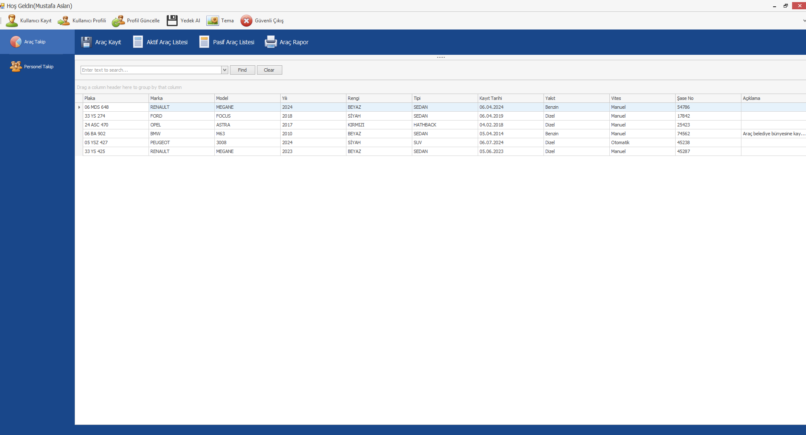
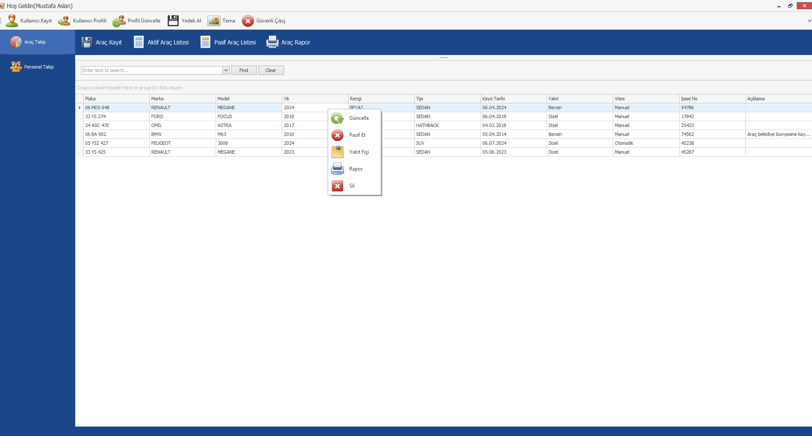
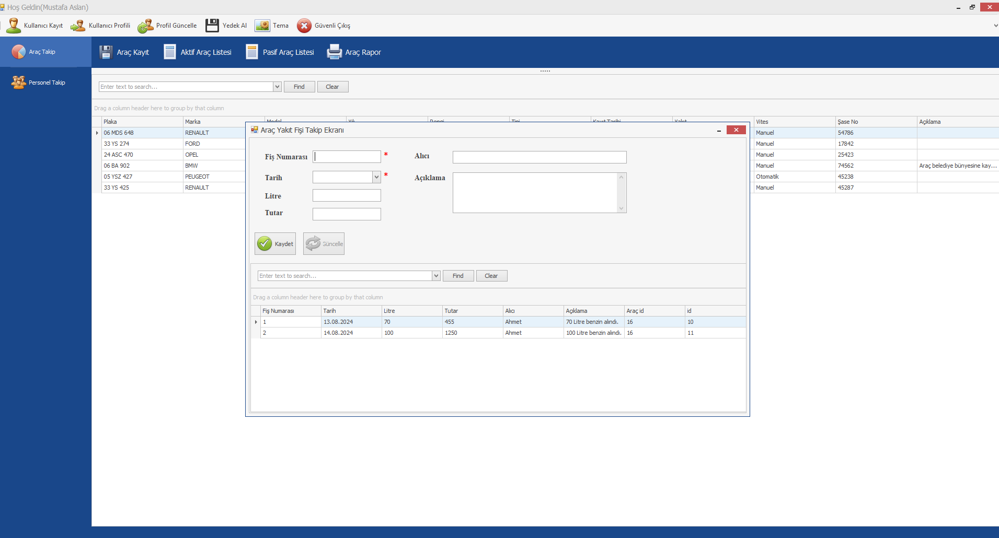
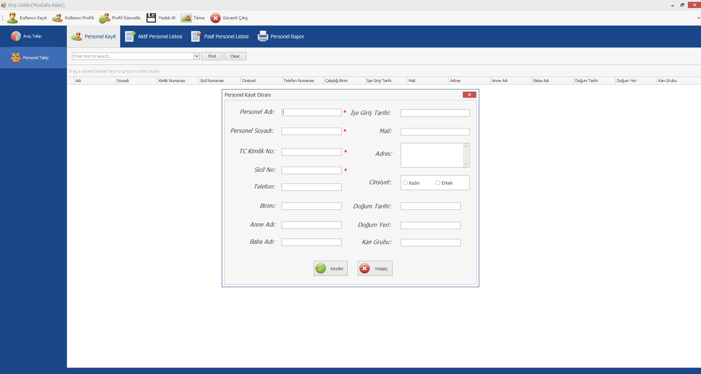
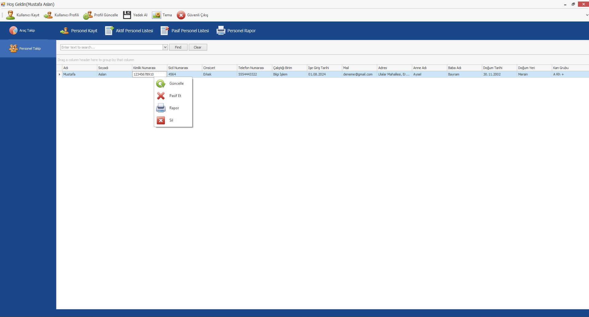
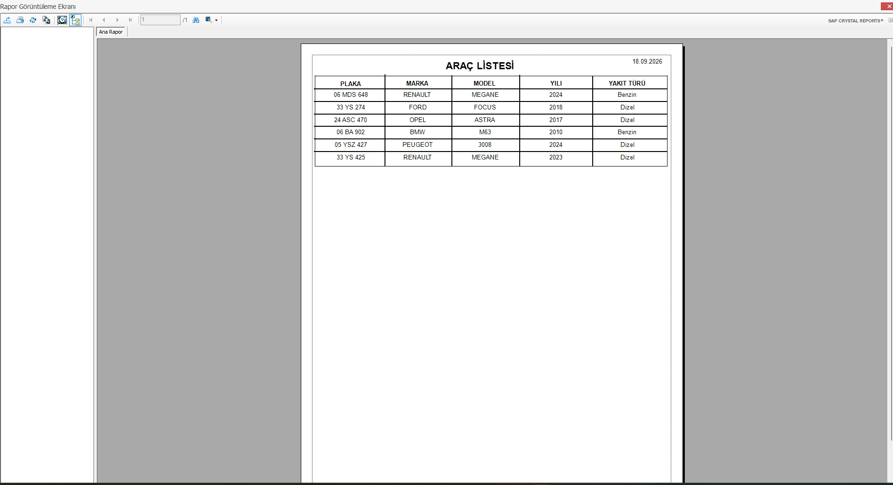
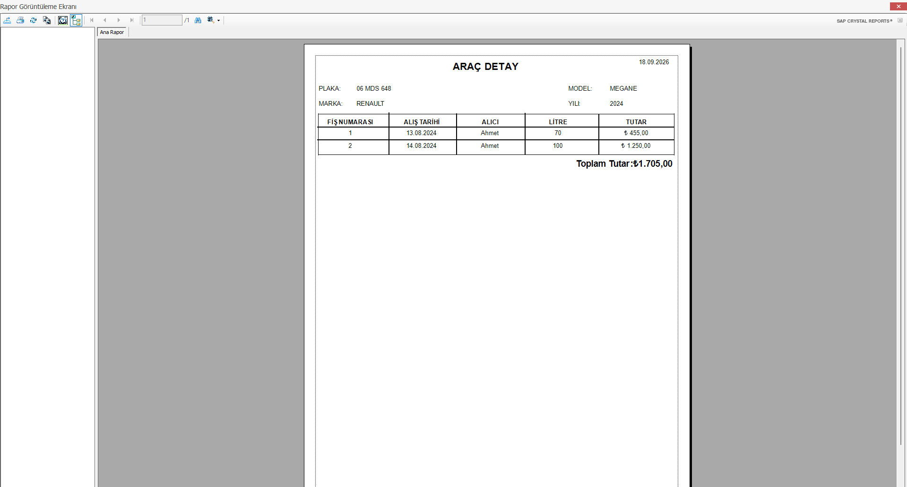

# Belediye Envanter, Araç ve Personel Takip Sistemi

<p align="center">
  
  
  
  
  
</p>

---

## Proje Genel Bakışı

**Belediye Envanter, Araç ve Personel Takip Sistemi**, belediye bünyesindeki hizmet araçlarının, iş makinelerinin, birim personellerinin ve araca özel yakıt giderlerinin tek bir çatı altından dijital olarak yönetilmesini sağlayan kurumsal bir masaüstü uygulamasıdır.

Sistem; kâğıt üzerindeki fiş ve evrak karmaşasını ortadan kaldırarak akaryakıt giderlerini, personel sicil kayıtlarını ve araç zimmet durumlarını kayıt altına alır ve **SAP Crystal Reports** altyapısıyla resmi evrak formatında raporlar.

---

## Temel Modüller ve Özellikler

### 1. Araç Filosu & Envanter Yönetimi
* **Teknik Sicil Kaydı:** Plaka, marka, model, yıl, renk, kasa tipi, yakıt/vites türü, şasi numarası ve özel açıklamalar.
* **Aktif / Pasif Ayrımı (Soft Delete):** Görevde olan aktif araçlar ile arızalı/hurdaya ayrılmış araçların ayrı listelerde takibi.
* **Gelişmiş Filtreleme:** Kolon bazlı gruplama, anlık arama (Find/Clear) ve sıralama desteği.
* **Sağ Tık (Context) Menüsü:** Seçili araca özel hızlı aksiyonlar:
  * ✏️ Güncelle
  * ⏸️ Pasif Et / Aktif Et
  * ⛽ **Yakıt Fişi Girişi ve Geçmişi**
  * 🖨️ Rapor Görüntüle
  * ❌ Sil

---

### 2. Yakıt Fişi & Tüketim Takibi
* **Araca Özel Fiş Girişi:** İlgili araca sağ tıklanarak doğrudan o aracın ID'sine bağlı fiş kaydı oluşturma.
* **Detaylı Masraf Kaydı:** Fiş numarası, alış tarihi, yakıt litresi, birim/toplam tutar, teslim alan alıcı personel ve açıklama bilgisi.
* **Geçmiş Yakıt Hareketleri:** Araç ekranının altındaki dinamik listede o araca ait tüm geçmiş yakıt fişlerinin listelenmesi.

---

### 3. Personel Özlük & Sicil Yönetimi
* **Kapsamlı Özlük Formu:** Ad, Soyad, TC Kimlik No, Sicil No, Görev Birimi, İşe Giriş Tarihi, Telefon, E-posta, Adres, Cinsiyet, Doğum Tarihi/Yeri, Anne/Baba Adı ve Kan Grubu.
* **Durum Takibi:** Aktif çalışanlar ve görevden ayrılan personeller için bağımsız filtreleme.
* **Hızlı Yönetim:** Personel listesi üzerinde sağ tık menüsüyle profil güncelleme, pasife alma ve sicil dökümü.

---

### 4. SAP Crystal Reports ile Resmi Raporlama
* **Genel Araç Listesi Raporu:** Belediye envanterindeki tüm araçların marka, model, yıl ve yakıt türüyle A4 resmi evrak dökümü.
* **Araç Detay & Yakıt Harcama Raporu:** Seçilen araca ait tüm akaryakıt alımlarının (fiş no, alış tarihi, alıcı, litre, tutar) listelenmesi ve **Toplam Tutar (₺)** maliyet hesabı dökümü.
* **Yazdırma ve Dışa Aktarma:** Dökümleri tek tıkla fiziksel yazıcıya gönderme veya PDF/Excel olarak dışa aktarma (Export).

---

### 5. Sistem & Güvenlik Yönetimi
* **Kullanıcı & Profil Yönetimi:** Giriş yapan kullanıcının oturum bilgisi, yetkilendirme ve profil güncelleme.
* **Tek Tıkla Veritabanı Yedeği (Yedek Al):** Olası çökme veya veri kaybına karşı doğrudan arayüzden MS Access veritabanı yedeği alabilme.
* **Tema Değiştirici:** Kurum renklerine uygun görsel tema desteği.

---

## Ekran Görüntüleri (Arayüz & Raporlar)

### Araç Takip & Sağ Tık Menüsü
| Aktif Araç Listesi ve Arama | Sağ Tık Hızlı İşlem Menüsü |
|:---:|:---:|
|  |  |

---

### Yakıt Fişi Takip Modülü
> Araç sağ tık menüsünden erişilen; araca ait fiş girişinin ve alt kısımda geçmiş yakıt kayıtlarının yer aldığı takip formu:

<p align="center">
  
</p>

---

### Personel Yönetimi
| Personel Detaylı Kayıt Formu | Personel Sağ Tık Menüsü |
|:---:|:---:|
|  |  |

---

### SAP Crystal Reports Resmi Çıktıları
| Genel Araç Listesi Raporu | Araç Detay & Yakıt Harcama Raporu |
|:---:|:---:|
|  |  |

---

## Kullanılan Teknolojiler

| Alan | Teknoloji |
| :--- | :--- |
| **Programlama Dili** | C# (.NET Framework) |
| **Arayüz (UI)** | Windows Forms (WinForms), Gelişmiş Grid Bileşenleri |
| **Veritabanı** | Microsoft Access Database (`.accdb` / Microsoft.ACE.OLEDB) |
| **Raporlama Aracı** | SAP Crystal Reports Runtime for .NET |
| **Mimari** | Modüler Form Mimarisi, Soft-Delete Veri Güvenliği, Yedekleme Servisi |

---

## Kurulum ve Çalıştırma

### Sistem Gereksinimleri
1. **İşletim Sistemi:** Windows 10 / 11 (x86 veya x64)
2. **.NET Framework:** 4.7.2 veya üzeri
3. **Microsoft Access Database Engine:** OLEDB sürücüsü yüklü olmalıdır.
4. **SAP Crystal Reports Runtime:** Rapor ekranlarının çalışması için Crystal Reports Runtime (32-bit/64-bit) kurulu olmalıdır.
5. **Geliştirme Ortamı:** Visual Studio 2019 / 2022

### Kurulum Adımları
1. Repoyu bilgisayarınıza klonlayın:
   ```bash
   git clone https://github.com/kullanici-adiniz/belediye-envanter-takip.git
   ```
2. `BelediyeEnvanterTakip.sln` çözüm dosyasını Visual Studio ile açın.
3. Veritabanı dosyasının (`.accdb`) bağlantı yolunu `App.config` dosyasından kontrol edin.
4. Projeyi derleyin (`Build Solution`) ve `F5` tuşuna basarak çalıştırın.

---

## Geliştirici

* **Mustafa Aslan**

---
